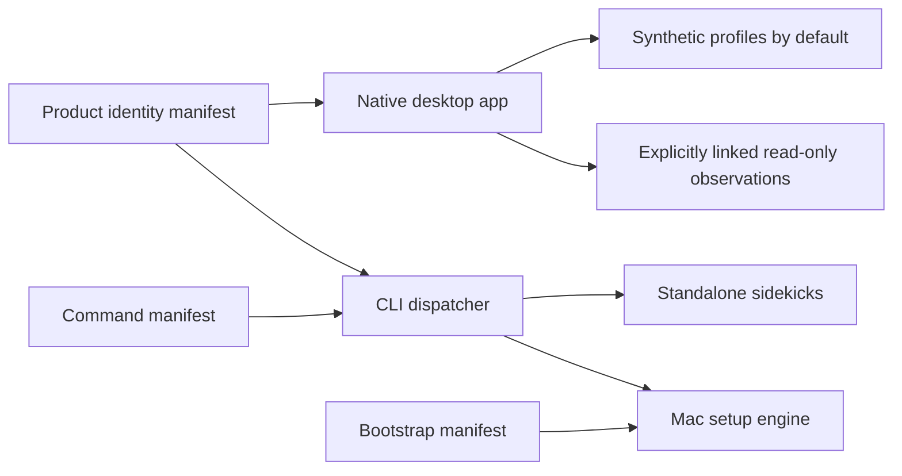

# geordi

A native Mac system explorer with a CLI sidekick and a manifest-backed Mac setup engine. One folder, one repository.

| Surface | Purpose | Location |
|---|---|---|
| Desktop | Explore applications, processes, files, startup behavior, and installation evidence | `Sources/`, `Tests/` |
| CLI | Dispatch helper scripts, including duplicate-file review | `bin/`, `cli/` |
| Mac setup | Compare desired software with installed inventory; preview and explicitly apply missing installs | `bootstrap/` |

## Safety boundaries

- **Desktop first launch is synthetic.** Linking a Mac is explicit; observation stays local and read-only.
- **Duplicate cleanup requires confirmation.** Use the report mode for inspection without deletion.
- **Setup previews before installing.** Inventory refresh changes the manifest, not the machine. Real installs require an explicit apply action and confirmation.
- **Installed evidence is not a desired default.** Manually installed apps without a verified installer remain visible as manual inventory rather than guessed Homebrew packages.
- **No automatic uninstall.** Differences between the Mac and its manifest are reported, not resolved by removing software.

## Configuration

| Contract | Source |
|---|---|
| Product identity | `Sources/GeordiManifestKit/Resources/product-brand.json` and its versioned schema |
| Desktop collection and display | Schema-backed resources under the corresponding Swift modules |
| Synthetic and normalized live profiles | `Sources/GeordiProfileSchema/Resources/system-profile.schema.json` |
| CLI commands | Versioned command registry under `cli/` |
| Software setup and installed inventory | `bootstrap/manifest.json` and its versioned schema |

Product-facing identity is shared by the desktop, packaging scripts, and CLI. Swift module names are build identifiers rather than additional display-name configuration.

## Development

Desktop requirements: macOS 15+, a compatible Swift 6.2+ toolchain, and Xcode tools. The dispatcher and duplicate-file sidekick use Python's standard library. The setup engine uses Node.js 20+.

See [USAGE.md](cli/USAGE.md) for installation and commands, [DEVELOPMENT.md](docs/policies/development.md) for desktop development, and [bootstrap/README.md](bootstrap/README.md) for setup behavior.

## Documentation

All documentation lives under `docs/`:

| Folder | Contents |
|---|---|
| `docs/architecture/` | System design, configuration model, schema versioning, technology decisions |
| `docs/product/` | Vision, features, roadmap, evaluation guides, status |
| `docs/plans/` | Active and parked plans |
| `docs/policies/` | Privacy, security, data lifecycle, testing, development, engineering |
| `docs/real-data/` | Real-data wiring analysis and backlog |
| `docs/decisions/` | Architecture decision records |
| `docs/archive/` | Completed-phase and acceptance records |

Start with [Architecture](docs/architecture/architecture.md), [Current status](docs/product/status.md), or [Testing](docs/policies/testing.md).

Continuous Integration runs `make verify` (desktop), the CLI unittest suite, and the bootstrap Node suite on every push and pull request. A new push to the same branch cancels the older run.
