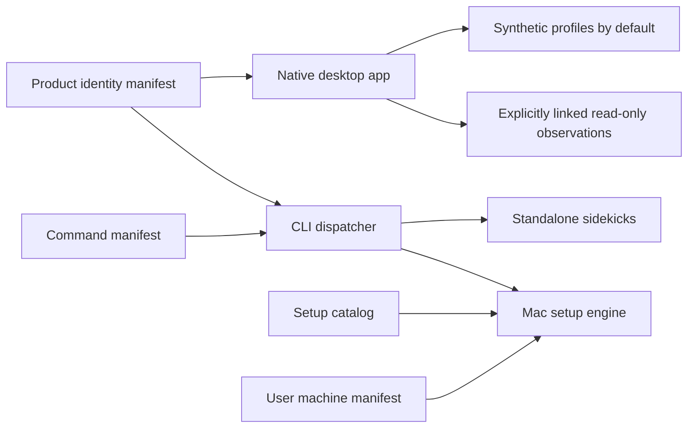

# geordi Architecture

## Architectural goal

Build a local, testable system that separates observed facts from inferred
relationships, presentation, and user-authorized actions.

## Repository composition

The repository's three surfaces (desktop app, CLI, setup engine) are wired
together through manifest resources, not hardcoded registries:



## System shape

```text
macOS collectors
      |
      v
normalization
      |
      +------> immutable observations
      |
      v
identity and relationship resolution
      |
      +------> evidence-scored edges
      |
      v
findings and explanation engine
      |
      v
SQLite history
   /       |        \
Swift UI   CLI   notifications
                    |
                    v
             explicit action layer
```

## Layers

### Collectors

Gather platform facts. They do not decide that an item is dangerous,
reclaimable, or owned by an application.

Examples:

- Applications
- Processes
- Signatures
- Persistence
- Filesystem sizes
- Package receipts
- Resource samples

Collectors return typed observations and capability/permission status.

### Normalization

Converts platform representations into stable domain entities while preserving
raw evidence where useful.

### Identity and relationship resolution

Correlates facts using bundle identifiers, Team IDs, executable paths, package
receipts, process ancestry, timing, and path conventions.

Every inferred edge includes:

- Relationship type
- Confidence
- Supporting evidence
- First and last observation
- Resolver/rule version

### Findings and explanations

Rules convert facts and relationships into reviewable statements. Explanation
objects include human-readable summaries plus structured evidence.

### Persistence

SQLite stores current entities, observations, history, relationships, findings,
decisions, incidents, and actions. Database access is isolated behind
repositories and migrations.

### Presentation

The SwiftUI/AppKit application presents multiple lenses over the same model.
The relationship canvas depends on presentation models, not collectors or SQL.

### Actions

Actions such as cleanup are separate from findings. They require fresh target
validation, authorization, a preview, recovery information, and an audit
record.

## Dependency direction

```text
UI/CLI -> application services -> domain
collectors -> domain
persistence adapters -> domain
actions -> application services -> domain
```

The domain layer does not depend on SwiftUI, SQLite implementation details, or
macOS command-line output.

## Configuration boundary

Configuration is typed, versioned, validated, and injected. It includes
thresholds, schedules, exclusions, retention, collector choices, notification
preferences, and explicitly enabled sensitive telemetry.

## Background architecture

Begin with in-process manual scans. Add supported background registration only
when a useful scheduled workflow exists. A privileged helper or system
extension is a separate security boundary and must not be introduced as a
convenience.

## Visualization architecture

The visualization consumes a stable graph projection:

- Nodes with identity, semantic type, state, and presentation priority
- Edges with direction, type, confidence, and evidence
- Groups/layers
- Time selection
- Current focus and highlighted paths

Layout, animation, interaction, and visual styling remain separate from the
domain graph so synthetic fixtures can drive deterministic tests.

## Extensibility

Collectors and resolvers use protocols where multiple implementations or test
doubles are real requirements. Avoid speculative plugin systems in V1.

The conceptual model may support future platforms, but macOS-specific evidence
is preserved rather than flattened.
